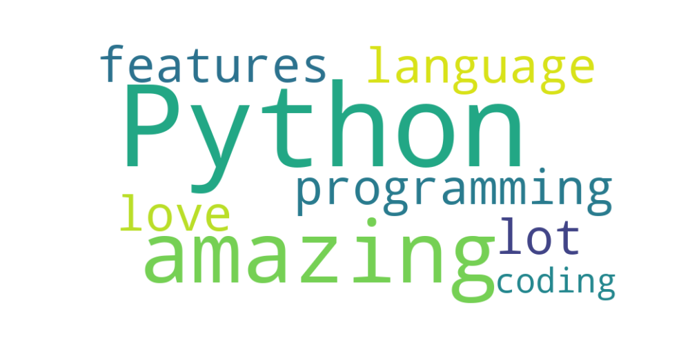

# Проект по AI

## Обзор
### Этот проект демонстрирует использование различных техник искусственного интеллекта, включая машинное обучение (ML), обработку естественного языка (NLP) и компьютерное зрение (OpenCV). 
### Проект включает несколько модулей и примеры, которые показывают применение этих техник на различных изображениях.

## Модули:

### Машинное обучение (ML)
- Линейная регрессия (Linear Regression)
- Логистическая регрессия (Logistic Regression)
- Дерево решений (Decision Tree)
- Случайный лес (Random Forest)
- Метод K-средних (K-means)

- Метод опорных векторов (SVM, Support Vector Machine)

- Обучение нейросети с библиотекой TensorFlow

### Обработка естественного языка (NLP)
- Определение частей речи в тексте
- Приведение слов к их начальной форме (лемматизация)
- Определение синтаксических связей между словами
- Удаление стоп слов из текста ("и", "или")
- "Облако слов"

- Определение эмоциональной тональности текста в виде числа от -1 до 1
- Распознавание речи

### Компьютерное зрение (OpenCV)
- Получение свойств изображения
- "Перекраска" изображения из цветного в черно-белое (серое)

 

- Обрезка фото

- Поворот изображения
- Смена яркости и контрастности изображения
- Распознавание лиц на изображении

- Распознавание мордочек кошек на изображении <3

- Распознавание номера авто на изображении

 

- Распознавание лица на веб-камере
- Создание "маски" для лица и применение ее в реальном времени (когда включена веб-камера)
